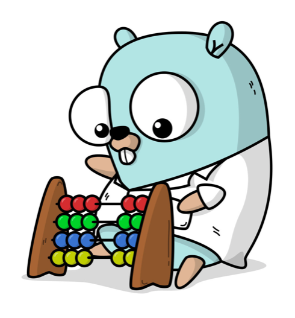
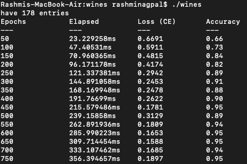

# Deep Learning For Gophers

This repository contains basic implementation of feedforward/backpropagation neural network from scratch in golang.

<p align="center">
 
 </p>

## Install
```
go get -u github.com/RN0311/deep-learning-for-gophers

```
## Code usage

```go
import (
	"fmt"
	"github.com/RN0311/deep-learning-for-gophers/training"
)
```

Create a neural network:
```go
n := deep.NewNeural(&deep.Config{
	/* Input dimensionality */
	Inputs: 2,
	/* Two hidden layers consisting of two neurons each, and a single output */
	Layout: []int{2, 2, 1},
	/* Activation functions: Sigmoid, Tanh, ReLU, Linear */
	Activation: deep.ActivationSigmoid,
	/* Determines output layer activation & loss function:*/
	Mode: deep.ModeBinary,
	/* Weight initializers: {deep.NewNormal(μ, σ), deep.NewUniform(μ, σ)} */
	Weight: deep.NewNormal(1.0, 0.0),
	/* Apply bias */
	Bias: true,
})
```

See ```examples/``` to train model on **Wine Dataset**:

## Output
<p align="center">
 
 </p>
